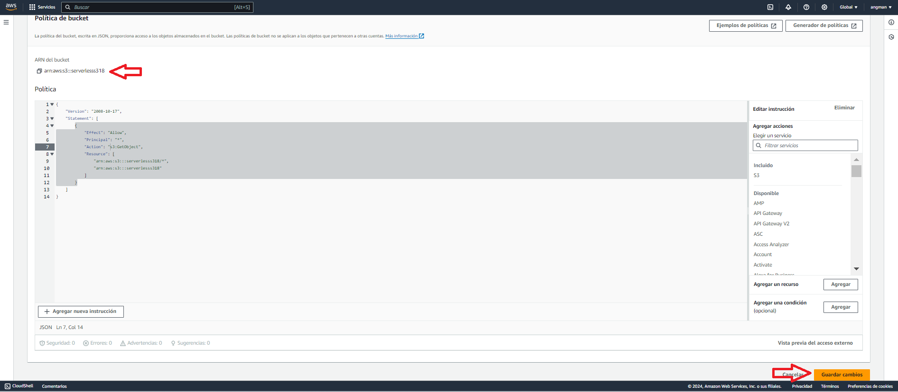

## Example e-commerce catalog shop based on AWS Lambda
# AWS_App_Ecommerce_Serverless
**APP ECOMMERCE SERVERLESS**

Es una web sin servidor que ofrece el servicio de ventas de productos a través de internet, desarrollada en AWS.

**CARACTERISTICAS:**

- Al ser serverless(sin servidor) solo paga por uso.
- Tiene una estructura de microservicios.
- Contiene carrito de compras, proveedor de pagos y galería de productos.

**Arquitectura:**

# 

## Funcionamiento:

 El cliente entra a la web, automáticamente la web buscara en el cloudfront para revisar si lo que el cliente pide esta almacenado (cache) en las zonas de borde con el fin de disminuir la latencia, sino esta ira al origen que es el S3 donde esta alojada nuestra app.

Se activará la API Gateway a través un método llamado /get\_items para activar una función lambda que iterará sobre la base de datos para devolvernos todos los productos almacenados (catalogo).

Nota: La api donde estaban las imágenes ya no funciona por lo que se le creo un nuevo atributo a los elementos de la BD llamado link que almacena URL de imágenes para mostrarse en la app.     

Si el cliente hace una petición de compras la API a través de otro método llamado /buy\_item activa una función lambda que te dirige a un proveedor de pago te envía un SNS que llegara a tu correo suscrito al topic (tema), lo que activa otra función lambda que interactúa con el servicio de Amazon simple email service, encarga de enviar un email a los interesados.

# 

## CREACION:
Para empezar, creamos un entorno de desarrollo, vamos a la consola de aws y en el panel servicios, buscamos cloud9 (click).

# 

Nos dirigirá a esta ventana donde le daremos a crear entorno (parte superior derecha). 

# 

Nos mostrara esta ventana donde configuraremos nuestro entorno y una instancia de EC2 para acceder al entorno.

# 

Le damos Crear y nos devolverá a la página anterior.

# 

Vemos que esta el entorno que acabamos de crear, le damos a abrir y nos enviara al IDE de Cloud9:

# 

En la terminal vamos a colocar el siguiente comando para clonar el repositorio:

> git clone https://github.com/epsagon/retail-store-workshop.git 

Confirmamos que se hizo la descarga:

# 

Luego vamos a ubicarnos dentro del proyecto:

> cd retail-store-workshop

Vamos a comenzar trabajando con el Backend, para ello vamos a ubicarnos en la carpeta del backend:

> cd backend

> ***Nota:*** Antes de continuar abra el archivo serverless.yml** y en la línea 15, cambie python3.7 por uno más actual, en mi caso python3.9 (guarda); ahora vamos al archivo requirements.txt y vamos a agregar esta librería urllib3==1.26.6 (guarda).

Luego vamos a ejecutar una serie de comandos:

> sudo pip3 install boto3 

> npm install 

> npm install -g serverless

En el siguiente comando asegúrese de cambiar la región por la que está usando, en mi caso eu-west-1:

> sls deploy --region <REGION>

Tras una implementación exitosa, podemos ver el siguiente resultado:

# 

> **Nota:** Asegúrese de copiar el punto final, porque podremos usarlo pronto.

Ahora creemos algunos artículos en nuestro stock:

> python3 update\_db.py 4 <REGION>

>(El numero 4, representa en número de artículos que vamos a almacenar en nuestra DynamoDB).

Antes de continuar con el frontend (interfaz), vamos a ir a la consola de aws y creamos un bucket de S3 para almacenar nuestra app.

En servicios colocamos S3 y seleccionamos:

# 

Le damos a Crear Bucket:

# 

Configuramos el bucket:

- Colocamos la región en mi caso es us-east-1.
- Seleccionamos de uso general.
- Y le damos el nombre al bucket (el nombre del bucket es único si no te lo acepta coloca otro nombre).

# 

- Vamos a hacerlo de acceso público por lo que hay que quitar esta selección.

# 

- Te aparecerá esta ventana selecciona que lo reconoces.

# 

- Por último, vamos al final y le damos a Crear Bucket.

# 

Ahora vamos a darle los permisos al bucket creamos una política:

- Vamos a donde están todos nuestros bucket y hacemos click sobre el nombre del que acabamos de crear, en mí caso serverlesss318:

# 

- Vamos más abajo hasta donde dice Política de Bucket y clicamos en editar:

# 

- Copiamos este Json, que nos dará acceso a los objetos almacenados en el S3:

{
   
    "Version": "2008-10-17",
    "Statement": [
        {
            "Effect": "Allow",
            "Principal": "\*",
            "Action": "s3:GetObject",
            "Resource": [
                "<BucketName>/\*",
                "<BucketName>"
            ]
        }
    ]
}

- Sustituye <BucketName> por el arn de tu bucket.
- Y le damos a Guardar Cambios.

# 

Ahora en Servicios colocamos IAM y seleccionamos:

# 

- En el panel seleccionamos Roles y damos click sobre este rol catalog-shop-dev-us-east-1-lambdaRole.
- Luego vamos a Permisos y Clicamos en Agregar permisos y luego en Asociar políticas.

# 

- Añadimos las siguientes políticas administradas para el correcto funcionamiento de nuestra app.

# 

## Vamos a trabajar ahora en el frontend.

Volvemos a nuestro entorno de cloud9 y colocamos el siguiente comando para entrar en la carpeta del frontend:

> cd../frontend

Y Luego los siguientes comandos:

>npm install -g yarn 

>scottyjs yarn install

Ahora vamos al fichero config.js que se encuentra en la siguiente ruta frontend/src/config.js y copiamos el endpoint que habíamos obtenido anteriormente y la copiamos y vamos a config.js y la pegamos en donde dice API\_URL: de la siguiente manera:

# 

Guardamos los cambios.

> **Nota:** Solo copia hasta el .com y asegúrate de dejar el /dev al final y colocarlo entre comillas dobles.

Ahora vamos a habilitar el alojamiento de sitios web estáticos para que se nos genere una URL, vamos a la consola de AWS y en Servicios colocamos S3 y seleccionamos el bucket que acabamos de crear:

- Dentro del bucket, seleccionamos Propiedades.
- Vamos al final donde dice Alojamiento de sitios web estáticos y le damos a Editar.
- Nos abrirá una ventana, en Alojamiento de sitios web estáticos le damos a Habilitar.
- En Documento de Índice vamos a colocar index.html y le damos a Guardar Cambios.
# 

Vamos nuevamente a Alojamiento de sitios web estáticos, vemos que nos ha generado una URL.
# 

Volvemos a cloud9 e implementamos nuestra interfaz, para ello usamos los siguientes comandos:

>npm run build

>npm add @babel/runtime

En el siguiente comando cambia <name-bucket> por el nombre del S3 que creaste para esta app:

>aws s3 cp ./build s3://<name-bucket>/ --recursive

Obtendrás esta respuesta si todo esta ok:

# 

Copia la URL y abra una nueva ventana en su navegador pegue la URL, podrá visualizar la app:

# 

Ya la app esta activa sin embargo no podemos visualizar el catálogo de productos, esto se debe a que la API IMAGEN donde estaban las imágenes ya no está en funcionamiento, vamos a solucionarlo:

- Vamos a la consola de AWS y en Servicios colocamos Lambda y seleccionamos la llamada catalog-shop-dev-get-items.
- Seleccionamos código y vamos a eliminar el bucle for que está en la función **get\_items,** la función debe quedar como te muestro a continuación:
# 

- Guardamos (Ctrl+s) y damos click en Deploy.

Vamos nuevamente a la pestaña donde esta nuestra app y refrescamos, ya deberían verse los 4 espacios que guardamos en nuestra DynamoDB.

Ahora vamos a la consola de AWS y en servicios colocamos DynamoDB y seleccionamos.

Luego elegimos la tabla 
# 

Vamos a agregarle un atributo llamado link para guardar la URL de la imagen que desees guardar en tu BD para este elemento.

Para ello seleccionamos uno de los elementos damos click en acciones y luego en editar elemento.

# 

Ahora le damos a Agregar nuevo atributo, seleccionamos cadena (string), abrira una nueva fila; en la columna de nombre de atributo colocamos link y en valor colocamos la URL de la imagen que quieras para ese elemento.

# 

Le damos guardar, estos mismos pasos vamos a realizarlos para cada elemento de la tabla.

Vamos a la pestaña donde esta nuestra app, ahora debería verse así:

# 

Vamos a realizar una compra:

- Seleccionamos un producto, nos enviara a una nueva ventana con las características del producto:
# 

- Guardamos el producto en el carrito de compras (click en ADD TO CART):
# 

- Esto nos envía a la página del carrito de compras, ahora compraremos el producto (click en checkout).
- Nos envía a un formulario de 3 pasos donde debemos colocar el email, la dirección de envió y datos de la tarjeta para el cobro del producto.

# 

# 

# 

Antes de darle a COMPLETE ORDER vamos a la consola de AWS para suscribirnos al topic de SNS para que nos lleguen los mensajes de la compra.

- Primero en servicio colocamos sns y seleccionamos Simple Notification Service y luego en panel elegimos tema (topic).

# 

- En el topic con el nombre PaymentTopic le damos click.

# 

- Luego le damos a crear una suscripcion.

# 

- Nos enviara a configurar la suscripción:
- En ARN del tema colocamos la ARN que tiene el nombre del tema.
- En Protocolo elegimos Correo Electrónico.
- En Punto de enlace ponemos un email real donde queramos que nos llegue el mensaje.
- Finalmente, a Crear suscripción.

# 

- Nos llegara un email de confirmación al correo que coloco en la suscripción.

# 

- Dele a aceptar suscripción y se abrirá una nueva pestaña con un mensaje de confirmación.

# 

Ahora si compramos un producto nos llegara un email notificando la compra.

- Vamos a darle a COMPLETE ORDER.

# 

- Nos saldrá una ventana con el ID de la orden.

# 

- Simultáneamente nos llegara un email con los datos del producto y del comprador.

# 

Ya nuestra app realiza todos los servicios necesarios para ser operativa, pero para mejorar la disponibilidad para los clientes implementaremos el servicio de AWS CloudFront para disminuir la latencia usando sus zonas de borde para almacenar en cache y disminuir el tiempo de respuesta.

- Vamos a la consola de AWS y en Servicios colocamos cloudfront, seleccionamos.
# 

- Le damos a **Crear distribución (Create Distribution)** y configuramos.
- En dominio de origen (origin domain) seleccionamos el dominio del bucket donde esta alojada nuestra app, en mi caso es esta:
> serverlesss318.s3-website-us-east-1.amazonaws.com
- En Web Application Firewall (WAF) seleccionamos:
> Do not enable security protections.
- En Default root object - optional colocamos:
> index.html.
- En este caso dejaremos todo lo demás por default.
- Clicamos en **Crear distribución**.

# 

# 

# 

# 

Ya estaría creada, esperamos a que en Status diga Enable, luego clicamos sobre el ID del cloudFront acabado de crear y seleccionamos General.

# 

Copiamos el Distribution domain name y abrimos una nueva pestaña en el navegador y pegamos.

# 

Listo ya podemos desplegar nuestra app a través CloudFront.

> **Nota:** Prueba usar este dominio de CloudFront desde otra IP. Se desplegará igualmente nuestra app.

